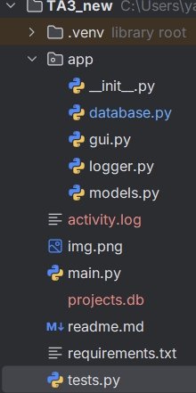
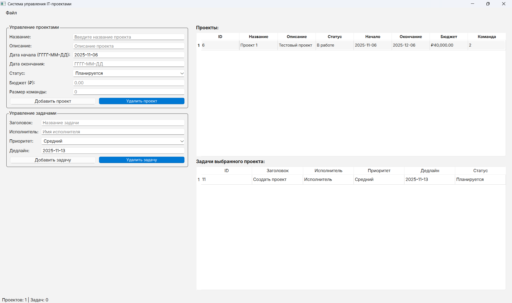

# Приложение для управления проектами в IT
## Функциональность
С помощью данного приложения можно создавать различные проекты, устанавливать сроки их завершения, обозначать ответственных,
команду, а также добавлять задачи к проектам.

## Технологии
* Python >=3.10, <3.14
* PyTest
* PySide6

## Установка и запуск
### Обычный:
`pip install -r requirements.txt
python main.py`
### Сравнение эффективности:
`python tasks_parallel`
### Тесты:
`python -m pytest tests.py -v`

## Архитектура

## Особенности
Модульная структура с пакетом из 4 модулей, дружелюбный интерфейс на PySide6, покрытие тестами PyTest, использование БД
(SQlite3), логгирование активности.

## Использование
После запуска доступна главная форма, содержащая:
1. Левую панель - окно ввода данных для проекта или задач.
2. Правую панель - окно вывода данных, отображает существующие записи из БД
3. Кнопку Файл, из которой доступен выход, просмотр логов и обновление страницы

#### Инструкция
* Для добавления задач необходимо кликнуть по нужному проекту, аналогично, для просмотра задач проекта нужно кликнуть по нужному проекту
* При удалении проекта удалятся все связанные с ним задачи

